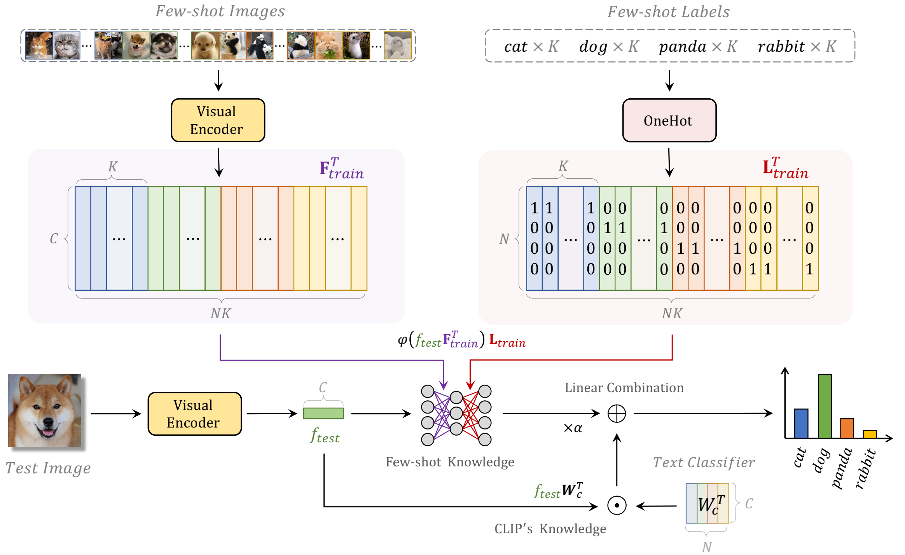

# Tip-Adapter: Training-free Adaption of CLIP for Few-shot Classification
Official implementation of ['Tip-Adapter: Training-free Adaption of CLIP for Few-shot Classification'](https://arxiv.org/pdf/2207.09519.pdf).

The paper has been accepted by **ECCV 2022**.

## News
* Our latest work, [CaFo](https://arxiv.org/pdf/2303.02151.pdf), is based on Tip-Adapter and accepted by **CVPR 2023** 🔥. Please refer [here](https://github.com/ZrrSkywalker/CaFo) for the code.

## Introduction

Tip-Adapter is a training-free adaption method for CLIP to conduct few-shot classification, which not only inherits the training-free advantage of zero-shot CLIP but also performs comparably to those training-required approaches. Tip-Adapter constructs the adapter via a key-value cache model from the few-shot training set, and updates the prior knowledge encoded in CLIP by feature retrieval. On top of that, the performance of Tip-Adapter can be further boosted to be state-of-the-art by fine-tuning the cache model for only 10x fewer epochs than existing approaches, which is both effective and efficient.  

<div align="center">
  
</div>

## Requirements
### Installation
Create a conda environment and install dependencies:
```bash
git clone https://github.com/gaopengcuhk/Tip-Adapter.git
cd Tip-Adapter

conda create -n tip_adapter python=3.7
conda activate tip_adapter

pip install -r requirements.txt

# Install the according versions of torch and torchvision
conda install pytorch torchvision cudatoolkit
```

### Dataset
Follow [DATASET.md](https://github.com/gaopengcuhk/Tip-Adapter/blob/main/DATASET.md) to install ImageNet and other 10 datasets referring to CoOp.

## Get Started
### Configs
The running configurations can be modified in `configs/dataset.yaml`, including shot numbers, visual encoders, and hyperparamters. 

For simplicity, we provide the hyperparamters achieving the overall best performance on 1\~16 shots for a dataset, which accord with the scores reported in the paper. If respectively tuned for different shot numbers, the 1\~16-shot performance can be further improved. You can edit the `search_scale`, `search_step`, `init_beta` and `init_alpha` for fine-grained tuning.

Note that the default `load_cache` and `load_pre_feat` are `False` for the first running, which will store the cache model and val/test features in `configs/dataset/`. For later running, they can be set as `True` for faster hyperparamters tuning.

### Numerical Results
We provide Tip-Adapter's **numerical results** in Figure 4 and 5 of the paper at [exp.log](https://github.com/gaopengcuhk/Tip-Adapter/blob/main/exp.log).

 CLIP-Adapter's numerical results are also updated for comparison.

### Running
For ImageNet dataset:
```bash
CUDA_VISIBLE_DEVICES=0 python main_imagenet.py --config configs/imagenet.yaml
```
For other 10 datasets:
```bash
CUDA_VISIBLE_DEVICES=0 python main.py --config configs/dataset.yaml
```
The fine-tuning of Tip-Adapter-F will be automatically conducted after the training-free Tip-Adapter.

## Contributors
[Renrui Zhang](https://github.com/ZrrSkywalker), Peng Gao

## Acknowledgement
This repo benefits from [CLIP](https://github.com/openai/CLIP), [CoOp](https://github.com/KaiyangZhou/Dassl.pytorch) and [CLIP-Adapter](https://github.com/gaopengcuhk/CLIP-Adapter). Thanks for their wonderful works.

## Citation
```bash
@article{zhang2021tip,
  title={Tip-Adapter: Training-free CLIP-Adapter for Better Vision-Language Modeling},
  author={Zhang, Renrui and Fang, Rongyao and Gao, Peng and Zhang, Wei and Li, Kunchang and Dai, Jifeng and Qiao, Yu and Li, Hongsheng},
  journal={arXiv preprint arXiv:2111.03930},
  year={2021}
}
```

## Contact
If you have any question about this project, please feel free to contact zhangrenrui@pjlab.org.cn and gaopeng@pjlab.org.cn.
